<div align="center">

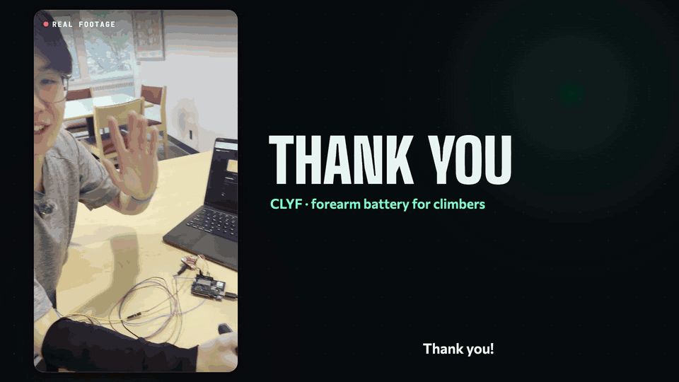

# CLYF

### Your forearms have a battery. Now you can see it.

A sleeve for climbers that reads your grip muscles with surface EMG and tells you, like a
sat-nav ETA, **when your forearms are ready to climb again.**

<a href="https://bigredhacks.com"></a>


<br>


**[▶ Watch the 60 s promo](media/clyf-promo-720p.mp4)** &nbsp;·&nbsp;
**[🌐 Project site](https://clyf-sleeve.vercel.app)** &nbsp;·&nbsp;
**[🗂 Slides (PDF)](deck/CLYF-deck.pdf)** &nbsp;·&nbsp;
**[📝 Devpost write-up](SUBMISSION.md)**

<sub>Built solo in one weekend at BigRed//Hacks 2026, Cornell.</sub>

</div>

---

## 🧗 The problem: climbers guess

Every climber knows the pump. Your forearms burn, your grip fades, and you hang off a jug
shaking out, wondering if you've rested enough.

- Rest **too little** and you fall off the next move.
- Rest **too long** and you burn the session.

> Maps give drivers an ETA. Climbers get guesswork.

## 🔋 The idea: a forearm battery with an ETA

CLYF turns grip effort into a battery that drains while you work and recharges while you rest.
Then it does what navigation apps do: it counts down to arrival.

| | What your forearm is doing | What CLYF shows |
| :-: | --- | --- |
|  | Working above a sustainable level | The battery drains, faster the harder you squeeze |
|  | Hands off, recovering | It recharges with a countdown: **"Ready in 12 s"** |
|  | "Resting", but still tense | The EMG notices and recharging slows down |
|  | Back above 80% | It glows mint and chimes: **climb on** |

## 🎬 See it work

<div align="center">
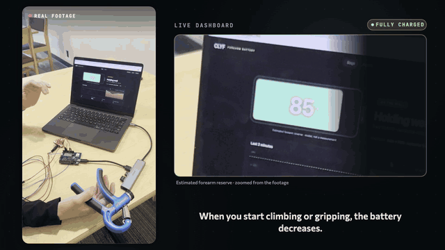
<br><sub>Real footage, 2× speed. Squeeze and the battery drains; let go and it charges back to READY.</sub>
</div>
<br>

One real session, the battery read off the dashboard once per second:

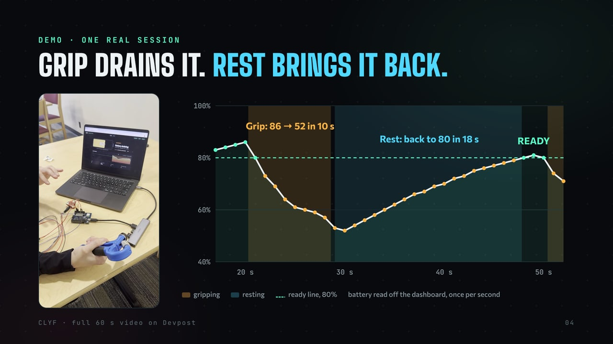

**Grip: 86 → 52 in 10 s. Rest: back to 80 in 18 s.** The muscle signal underneath is measured. The
battery on top is a model, and the screen says so.

## ⚙️ How it works

<div align="center">
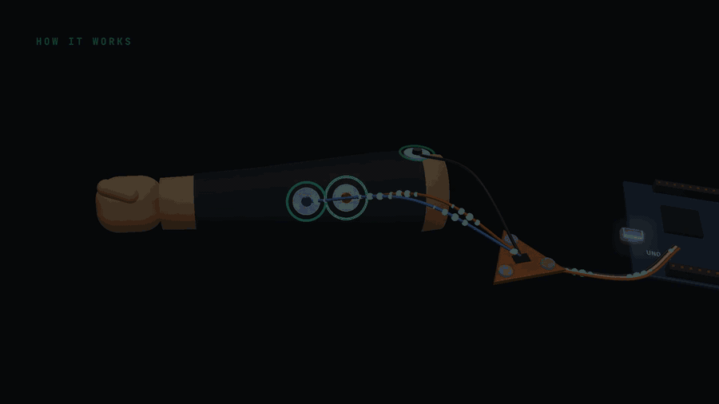
</div>

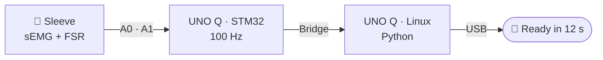

1. **Sense.** Three electrodes on the finger flexors, the muscles that close your hand on a hold, feed a
   MyoWare 2.0. A small force sensor marks when the hand is on the hold.
2. **Sample.** The UNO Q's STM32 reads both channels at 100 Hz on a fixed clock and hands every sample to
   the board's Linux side over the Arduino Bridge. **Zero dropped samples** in testing.
3. **Relay.** Python on the board streams to the laptop over the USB cable with an ADB port forward.
   Campus Wi-Fi isolates devices from each other, so there is deliberately no Wi-Fi anywhere in the chain.
4. **Navigate.** The dashboard smooths the envelope, calibrates itself, refuses to trust a broken signal,
   and runs the battery.

<details>
<summary><b>🧮 The battery model (with the maths)</b></summary>

<br>

Effort is the EMG envelope placed between your relaxed level and your hardest grip, as a percentage of
maximum voluntary contraction (%MVC). Both ends calibrate themselves: *relaxed* is the 10th percentile of
per-second medians over the last 30 s, and *max* is the highest per-second mean over the last 3 minutes.
The load $L$ is that effort smoothed with a 0.4 s time constant.

The battery $B$ is borrowed from the **W′-balance** model in endurance sport. Above a critical load it
drains in proportion to the excess:

$$
\frac{dB}{dt} = -\frac{L - L_c}{W'} \qquad (L > L_c)
$$

Below it, it refills exponentially, at a speed set by how relaxed the forearm really is:

$$
\frac{dB}{dt} = \frac{s}{\tau}(1 - B) \qquad (L \le L_c)
$$

where $s = \min\left(1, \max\left(0, \frac{L_c - L}{L_c - 10}\right)\right)$ is full speed when the forearm is under 10 %MVC
and slows to zero as it approaches $L_c$.

That makes the ETA a closed form:

$$
t_{\text{ready}} = \frac{\tau}{s} \ln\frac{1 - B}{1 - 0.8}
$$

| Constant | Default | Meaning |
| --- | --- | --- |
| $L_c$ | 30 %MVC | sustainable load |
| $W'$ | 800 %MVC·s | reserve above it |
| $\tau$ | 20 s | recovery time constant |
| ready | 80 % | when it says *climb on* |

Sanity check against the session above: from 52 %, $20 \cdot \ln(0.48/0.2) \approx 17.5$ s. The
dashboard took 18.

These are demo constants, not fitted to anyone. That's why the battery is labelled an estimate.

</details>

<details>
<summary><b>🩺 Measured vs. estimated, and how the dashboard stays honest</b></summary>

<br>

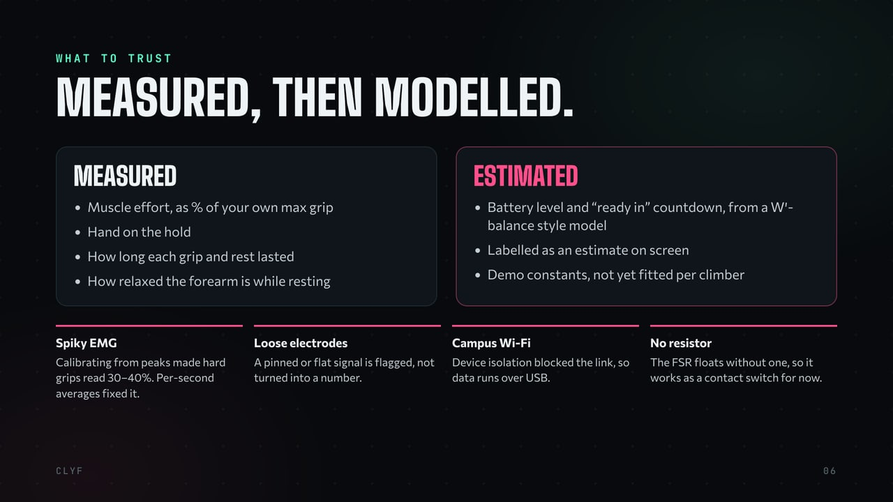

- **Pinned signal.** If more than 90 % of samples sit at the sensor's 3 V ceiling for 8 s, an electrode
  has probably lifted. The dashboard says so instead of showing a number.
- **Flat signal.** A suspiciously still mid-level voltage is flagged too. Near 0 V just means a relaxed
  forearm at low gain, so that one passes.
- **Hysteresis.** You're "on the wall" above 35 %MVC and off again below 60 % of that, with a short
  dwell, so one spike doesn't flip the state.

</details>

## 😤 Things that fought back

| Problem | What happened |
| --- | --- |
| **A flat 3 V "muscle"** | The first sessions read nothing but the ceiling. The reference electrode wasn't on bone and the gain was too high. Placement and skin prep mattered more than any code. |
| **A spiky envelope** | Mid-squeeze the signal leaps between 0.1 V and 3 V within a second, so calibrating from peaks made real grips read 30–40 %. Replaying recordings offline, per-second averages and longer smoothing fixed it. |
| **No pull-down resistor** | A floating analog pin happily echoes its EMG neighbour. The UNO Q's internal pulls turn out to cut the pin off from the ADC (measured on three pins), so the FSR is an on/off contact switch for now. |
| **The network** | Campus Wi-Fi blocks device-to-device traffic, and macOS AirPlay squats on port 7000. Hence USB, ADB, and `localhost:7700`. |

## 🛠️ Build your own

<details>
<summary><b>Parts, wiring and running it</b></summary>

<br>

**Parts**

- Arduino UNO Q
- MyoWare 2.0 Muscle Sensor with its Cable Shield, the 3-electrode cable and 24 mm gel electrodes
- A small FSR (SparkFun SEN-09673), plus a 22 kΩ resistor if you have one
- A compression sleeve, and something to squeeze (a grip trainer works)

**Wiring** (everything at 3.3 V; A0 and A1 are not 5 V tolerant)

| From | UNO Q |
| --- | --- |
| MyoWare VIN | 3V3 |
| MyoWare GND | GND |
| MyoWare ENV | A0 |
| FSR leg 1 | A2, driven HIGH as the FSR's supply |
| FSR leg 2 | A1 |
| *(recommended)* 22 kΩ | A1 → GND |

**Electrodes.** Red (MID) on the belly of the forearm flexors, blue (END) 2–3 cm further toward the wrist
along the muscle, black (REF) on bone: the bump of the wrist on the little-finger side, or the elbow.

**Run.** You need `adb` (Android platform-tools) and the board on USB.

```sh
./deploy.sh                    # push, compile, flash, start, forward localhost:7700 → board:7000
open http://localhost:7700
```

> ⚠️ **Safety:** while electrodes are on skin, the laptop connected over USB must run **on battery**,
> with the charger unplugged. Keep all three electrodes on one forearm.

</details>

## 📸 Gallery

<table>
  <tr>
    <td width="33%">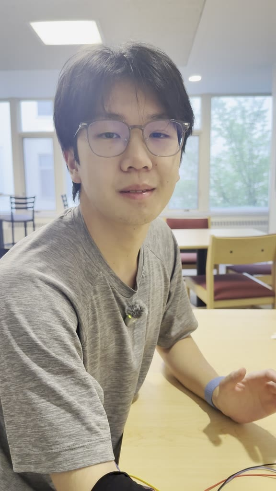</td>
    <td width="33%">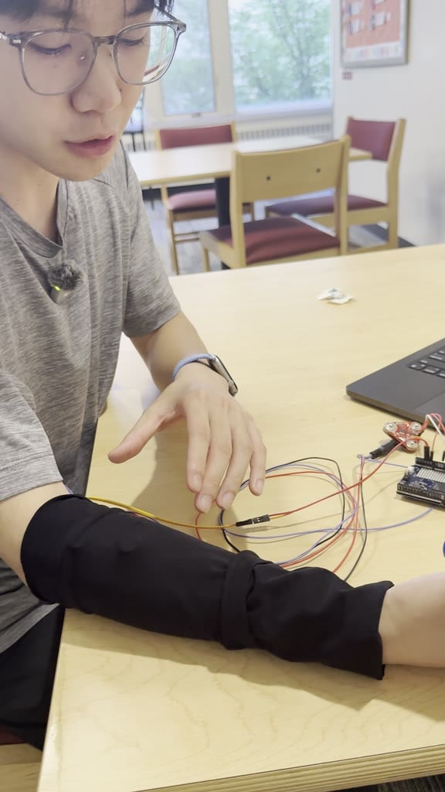</td>
    <td width="33%">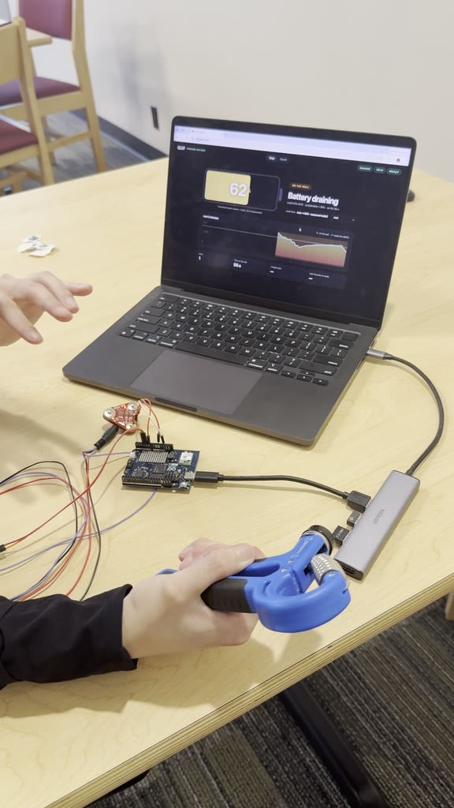</td>
  </tr>
</table>

The [project site](https://clyf-sleeve.vercel.app) has a 3D sleeve you can spin and explode, plus a
replay of a real recording:

<table>
  <tr>
    <td width="50%">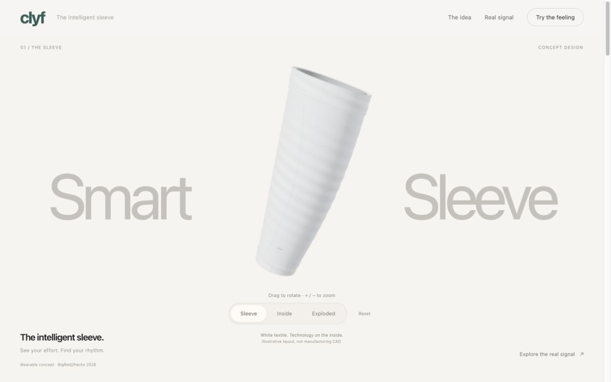</td>
    <td width="50%">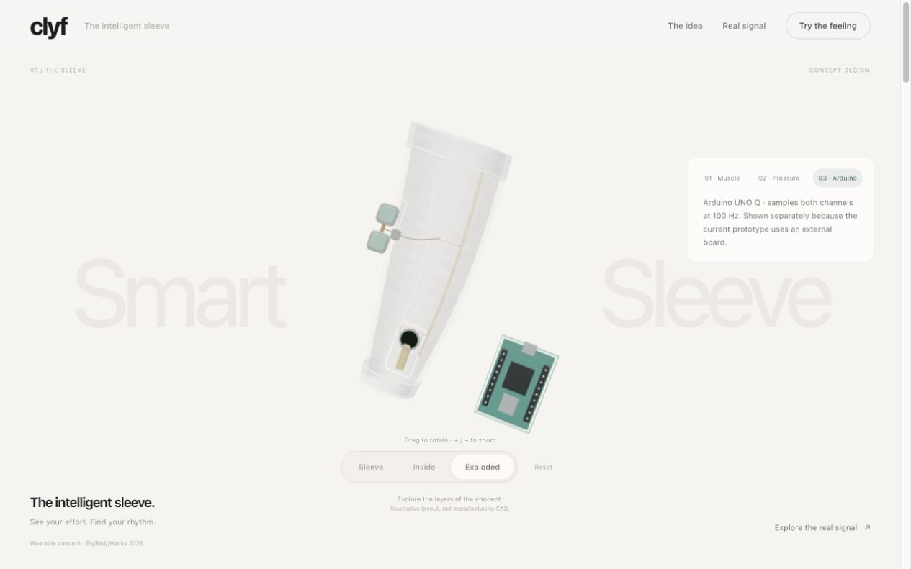</td>
  </tr>
  <tr>
    <td colspan="2">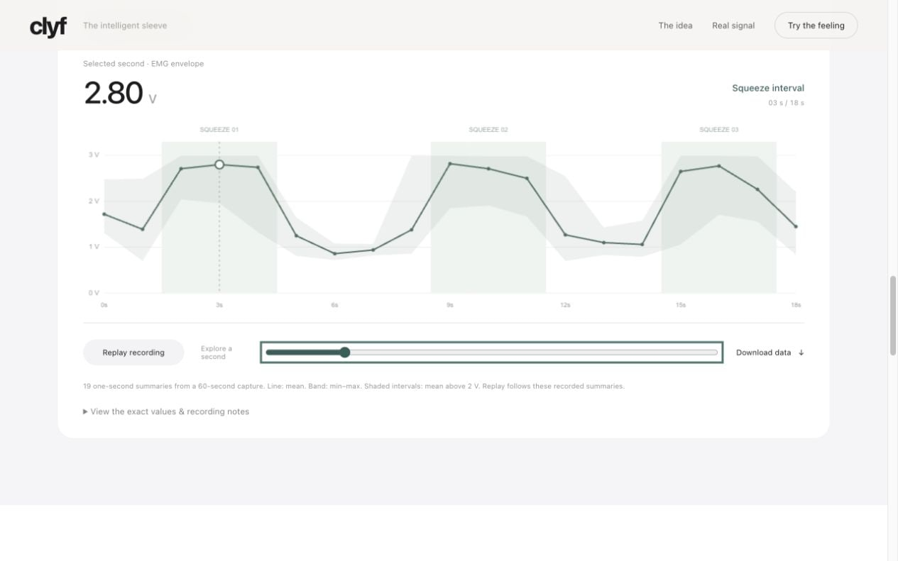</td>
  </tr>
</table>

## 🗺️ Repo tour

```text
app/              the UNO Q app, in Arduino App Lab layout
  sketch/         STM32 side: reads FSR + EMG at 100 Hz, Bridge.notify("sample", …)
  python/         Linux side: receives samples, counts gaps, serves /status and /recent
  assets/         the dashboard: battery stage view, raw signals, calibration, model settings
deploy.sh         push → compile → flash → start → forward to localhost:7700
site/             the project site (three.js), live at clyf-sleeve.vercel.app
deck/             pitch deck: HTML → PDF, plus a generator for an editable .pptx
promo/source/     how the promo was made: code-only video, see its README
media/            the GIFs, images and promo cut used in this README
SUBMISSION.md     the Devpost write-up
```

To rebuild the site, grab the filmed demo from the live site first (it's 24 MB, so it isn't in git):
`curl -o site/assets/video/clyf-demo.mp4 https://clyf-sleeve.vercel.app/assets/video/clyf-demo.mp4`,
then `cd site && npm ci && npm run build`.

## ✨ Fun facts

- The promo was edited without a video editor. Every frame was drawn by a browser canvas and
  three.js, and the soundtrack was synthesised from scratch in [pure Python](promo/source/audio/synth.py).
- The editable `.pptx` is generated by [measuring every element of the HTML deck in Chrome](deck/build_pptx.js)
  and rebuilding it as native shapes.
- The demo chart is the dashboard read straight off the demo footage, one frame per second.

## 🔭 What's next

- [ ] **Eyes on the wall, not on a screen:** a haptic "ready" tap on the wrist. The Bluetooth link is built.
- [ ] **Fatigue you can see:** sample the raw EMG and track its frequency shift, a known marker of muscle fatigue.
- [ ] **Fitted to you:** learn each climber's own drain and recovery rates from their sessions.
- [ ] **Wireless sleeve:** smaller board, battery power, a proper FSR resistor and a tidier fit.

---

<div align="center">

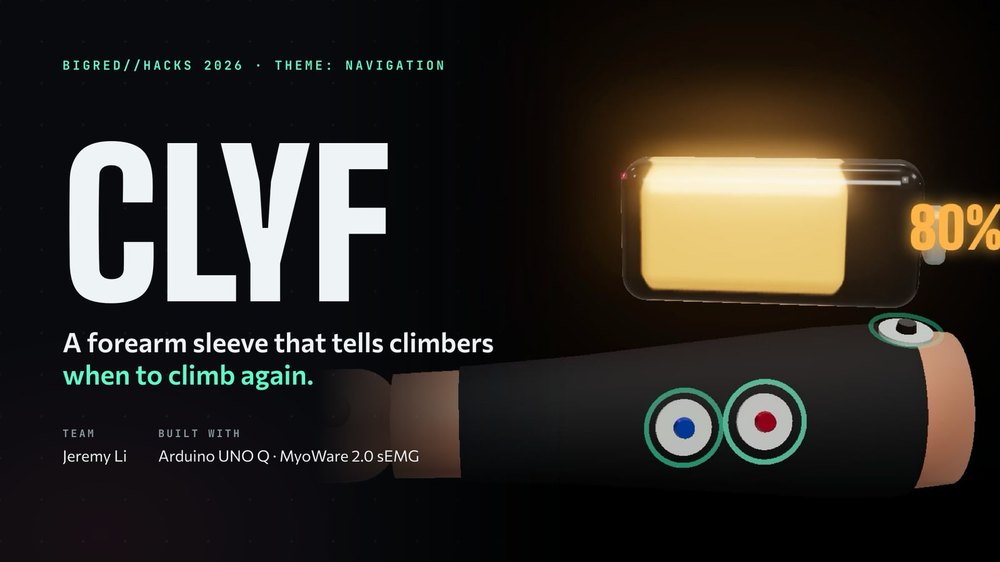

**Know when to climb again.**

Made by **Jeremy Li** at BigRed//Hacks 2026 · [MIT](LICENSE)

<sub>The battery is an estimate from a model with demo constants, not a medical or validated measure of fatigue.
The concept images on the project site are AI-generated and labelled as such.</sub>

</div>
